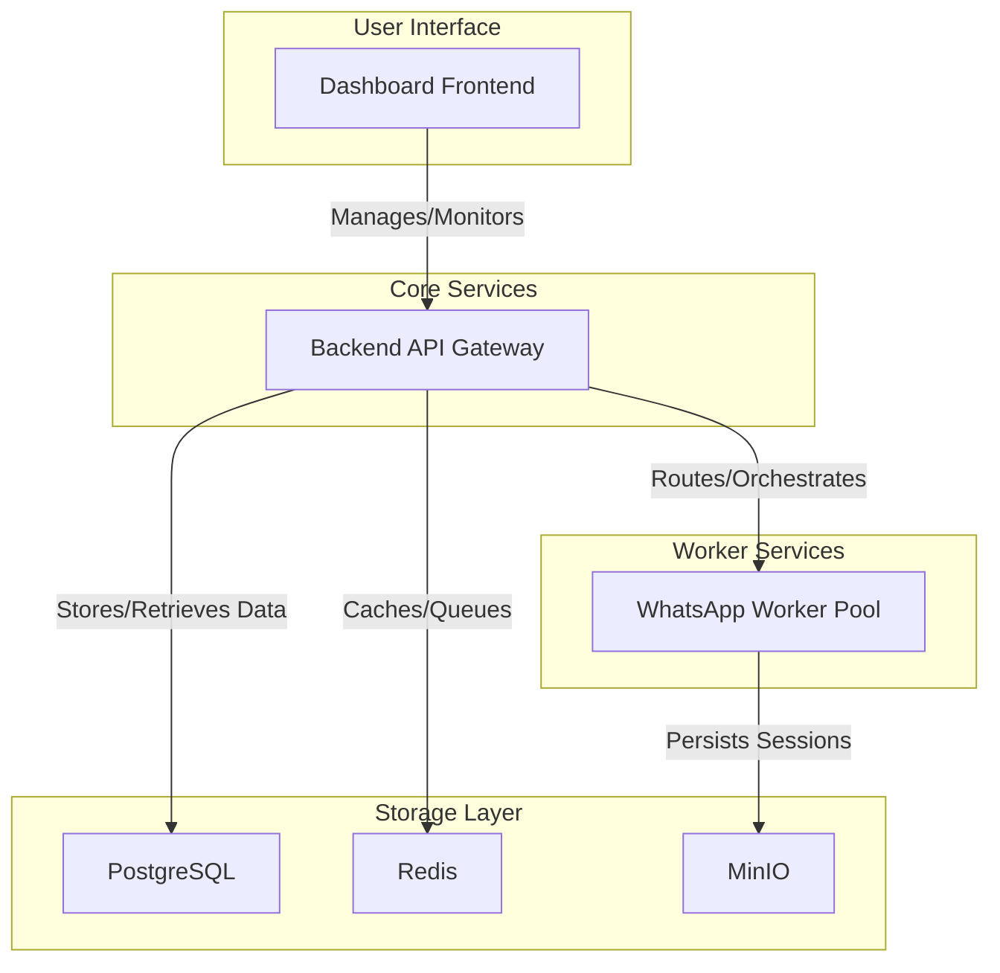
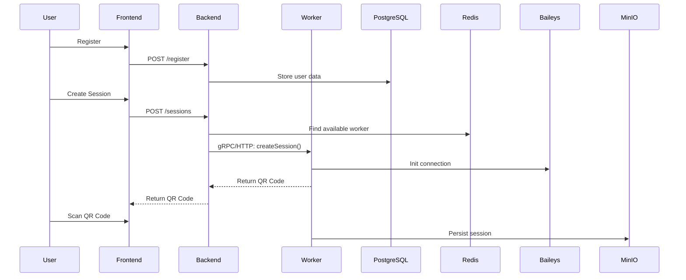
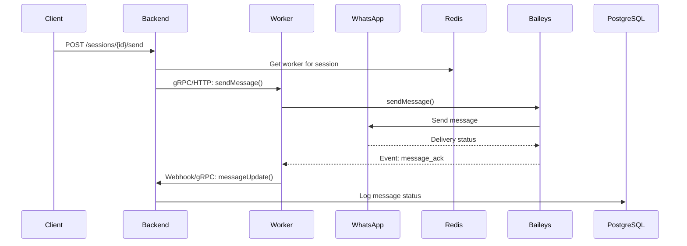

# WhatsApp Gateway PaaS - Architecture

## System Architecture Overview

The WhatsApp Gateway PaaS is a multi-component system designed for scalability and reliability. It consists of a Frontend Dashboard, a Backend API Gateway, and a pool of WhatsApp Workers.

## Component Breakdown

### 1. Dashboard Frontend

- **Technology:** Next.js, Tailwind CSS, shadcn/ui
- **Responsibilities:**
  - User authentication and management (for customers and admins).
  - Session management interface (create, view, delete sessions).
  - Real-time monitoring of worker and session status.
  - Admin-level control over workers and system settings.
  - Displaying usage analytics and billing information.

### 2. Backend API Gateway

- **Technology:** Node.js + Express (potential for Golang migration)
- **Responsibilities:**
  - Central API endpoint for all user and admin interactions.
  - User authentication and API key management.
  - Worker registration, discovery, and health monitoring.
  - Load balancing and routing of session requests to available workers.
  - Proxying requests from users to the appropriate worker.
  - Storing metadata (users, sessions, workers) in PostgreSQL.
  - Using Redis for real-time data like worker status and routing maps.

### 3. WhatsApp Workers

- **Technology:** Node.js, Express, @whiskeysockets/baileys
- **Responsibilities:**
  - Handling the actual WhatsApp Web protocol connections using Baileys.
  - Managing the lifecycle of multiple WhatsApp sessions.
  - Sending and receiving messages, media, and status updates.
  - Persisting session authentication data to MinIO for failover.
  - Reporting health and status back to the Backend Gateway.

## Data Flow Diagrams

### User Registration & Session Creation

### Message Sending Flow

## Scalability and High Availability

- **Horizontal Scaling:** The system is designed to scale horizontally by adding more WhatsApp Worker instances.
- **Load Balancing:** The Backend API Gateway distributes new sessions across the available workers based on their current load.
- **Session Failover:** If a worker fails, the Backend Gateway will detect this and re-assign its sessions to other healthy workers. The new workers will restore the sessions from the data stored in MinIO.
- **Database and Storage:** PostgreSQL, Redis, and MinIO are all designed to be run in clustered, high-availability configurations.
